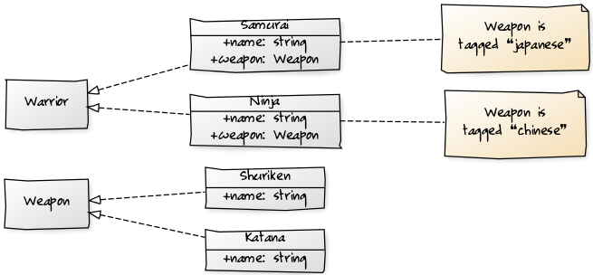

# inversify-basic-example
[](https://gitter.im/inversify/InversifyJS)
[](https://travis-ci.org/inversify/inversify-basic-example)
[](https://david-dm.org/inversify/inversify-basic-example#info=dependencies)
[](https://david-dm.org/inversify/inversify-basic-example/#info=devDependencies)
[](https://david-dm.org/inversify/inversify-basic-example/#info=peerDependenciess)

A basic example that showcases how to setup InversifyJS

This is a very basic InversifyJS example.

This program declares:
- Three interfaces `Warrior`, `Weapon` and `Battle`.
- Two implementations of `Weapon`: `Katana` and `Shuriken`
- Two implementations of `Warrior`: `Ninja` and `Samurai`
- One implementation of `Battle`: `EpicBattle`.

The warriors own a weapon and are tagged with some metadata.



We use some constraints `whenTargetNamed` and `whenParentNamed` to indicate which
`Weapon` should be injected into and implementation of `Warrior` and which implementation
of `Warrior` should injected into `EpicBattle`:

```ts
container.bind<Warrior>(SERVICE_IDENTIFIER.WARRIOR).to(Ninja).whenTargetNamed(TAG.CHINESE);
container.bind<Warrior>(SERVICE_IDENTIFIER.WARRIOR).to(Samurai).whenTargetNamed(TAG.JAPANESE);
container.bind<Weapon>(SERVICE_IDENTIFIER.WEAPON).to(Shuriken).whenParentNamed(TAG.CHINESE);
container.bind<Weapon>(SERVICE_IDENTIFIER.WEAPON).to(Katana).whenParentNamed(TAG.JAPANESE);
container.bind<Battle>(SERVICE_IDENTIFIER.BATTLE).to(EpicBattle);
```

# How can I run it?
You can either

[](https://gitpod.io#https://github.com/inversify/inversify-basic-example/blob/master/src/config/ioc_config.ts)

or clone it using:

```
$ git clone https://github.com/inversify/inversify-basic-example.git
```

To run this example you need to install some dependencies:

```
$ cd inversify-basic-example
$ npm install
```

And compile the TypeScript code into JavaScript code:

```
$ gulp
```

The generated code is available at the `dist` directory.

At this point you are ready to run the example:

```
$ node dist/main.js
```

You should see the following in console:

```
FIGHT!
                Ninja (Shuriken)
                vs
                Samurai (Katana)
```
